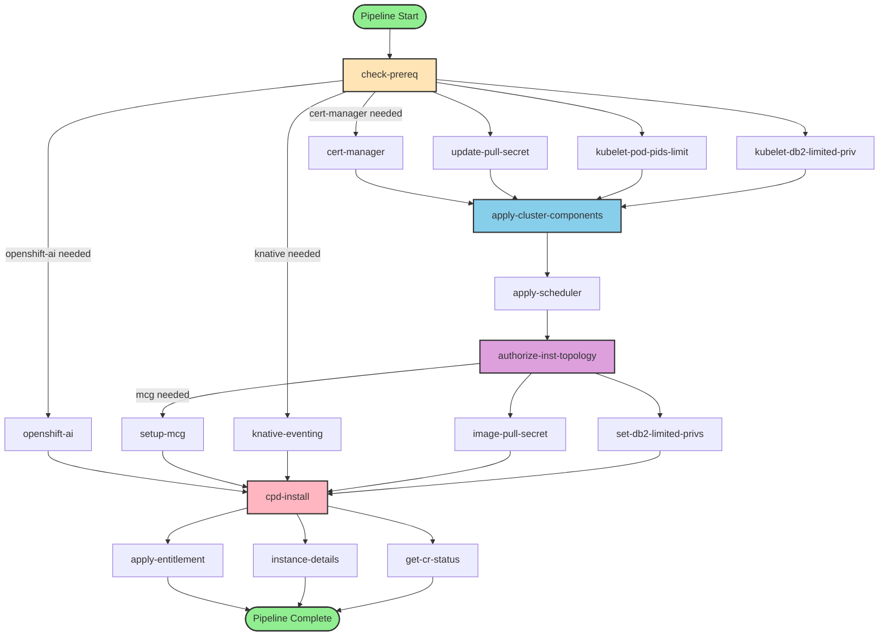

# CPD 5.3 Installation Pipeline Architecture

This document provides a visual representation of the IBM Cloud Pak for Data 5.3 installation pipeline flow.

## Pipeline Overview

The CPD 5.3 installation pipeline is a multi-stage Tekton pipeline that orchestrates the deployment of Cloud Pak for Data components on OpenShift. It handles prerequisites, cluster configuration, operator installation, and component deployment.

## Pipeline Flow Diagram

## Pipeline Stages Explained

### Stage 1: Prerequisite Detection
- **check-prereq**: Analyzes requested components and determines which prerequisites are needed
  - Checks for cert-manager availability
  - Determines if OpenShift AI is required
  - Identifies need for MCG (MultiCloud Gateway)
  - Checks for Knative Eventing requirements

### Stage 2: Prerequisite Installation (Conditional)
These tasks run only if prerequisites are detected:

- **cert-manager**: Installs RedHat Cert-Manager Operator (stable-v1 channel)
- **openshift-ai**: Deploys OpenShift AI Operator with DSCInitialization and DataScienceCluster
- **knative-eventing**: Sets up Knative Eventing for event-driven components
- **kubelet-pod-pids-limit**: Applies PID limits via MachineConfig (if supported)
- **kubelet-db2-limited-priv**: Configures kubelet for DB2 limited privilege mode

### Stage 3: Cluster Preparation
- **update-pull-secret**: Adds IBM Entitlement Registry credentials to global pull secret
  - Handles both standard and airgap scenarios
  - Includes workarounds for non-MCP clusters (ROKS, KubeVirt)

- **apply-cluster-components**: Installs foundational CPD cluster components
  - Downloads CASE files
  - Applies cluster-scoped resources
  - Sets up licensing namespace

### Stage 4: Scheduler and Authorization
- **apply-scheduler**: Installs IBM Scheduler (optional, controlled by SCHEDULER parameter)
  - Creates scheduler namespace
  - Configures entitlement secrets

- **authorize-inst-topology**: Configures namespace topology
  - Sets up operator namespace
  - Configures operand namespace
  - Establishes namespace relationships

### Stage 5: Component-Specific Setup
- **setup-mcg**: Configures MultiCloud Gateway for components requiring S3 storage
  - Creates NooBaa accounts
  - Configures certificates
  - Required for Watson Assistant, WatsonX Orchestrate

- **set-db2-limited-privs**: Creates DB2 product ConfigMap for limited privilege mode
- **image-pull-secret**: Creates IBM entitlement secrets in operator and operand namespaces

### Stage 6: Main Installation
- **cpd-install**: Core installation task (timeout: 8 hours)
  1. Downloads CASE files for all components
  2. Applies cluster-scoped resources
  3. Installs CPD platform and requested components
  4. Configures storage classes
  5. Applies custom install options

### Stage 7: Post-Installation
These tasks run in parallel after main installation:

- **apply-entitlement**: Applies license entitlements to the CPD instance
  - Supports multiple entitlement types (cpd-enterprise, watsonx-ai, etc.)
  - Configures production vs non-production mode

- **instance-details**: Retrieves and displays:
  - CPD instance URL
  - Admin username and initial password
  - Instance configuration details

- **get-cr-status**: Checks status of all Custom Resources in the CPD instance

## Key Parameters

| Parameter | Description | Default |
|-----------|-------------|---------|
| VERSION | CPD version to install | 5.3.x |
| COMPONENTS | Components to install | wml,ws (or watsonx_orchestrate) |
| PROJECT_CPD_INST_OPERANDS | Operand namespace | cpd (or watsonx) |
| PROJECT_CPD_INST_OPERATORS | Operator namespace | cpd-operators (or watsonx-operators) |
| STG_CLASS_BLOCK | Block storage class | Configurable |
| STG_CLASS_FILE | File storage class | Configurable |
| ACCEPT_LICENCE | License acceptance | Required |
| INSTALL_PREREQUISITE | Install prerequisites | true |
| SCHEDULER | Enable IBM Scheduler | false |
| APPLY_MACHINECONFIG | Apply MachineConfig | false |
| DB2_LIMITED_PRIV | DB2 limited privilege mode | false |

## Conditional Execution

The pipeline uses `when` clauses for conditional task execution:

1. **Prerequisite tasks** only run if `INSTALL_PREREQUISITE=true` and the specific prerequisite is detected
2. **Scheduler task** only runs if `SCHEDULER=true`
3. **MachineConfig tasks** only run if respective parameters are set to `true`
4. **MCG setup** only runs if components requiring it are detected

## Timeout Configuration

- **apply-cluster-components**: 1 hour
- **cpd-install**: 8 hours (main installation)
- **apply-entitlement**: 1 hour
- Other tasks use default timeouts

## Architecture Support

The pipeline supports multiple architectures through image tag suffixes:
- x86_64 (default, no suffix)
- ppc64le (`.ppc64le` suffix)
- s390x (`.s390x` suffix)

## Airgap vs Connected Mode

The pipeline adapts based on airgap configuration:
- **Connected**: Uses IBM Entitlement Key for cp.icr.io
- **Airgap**: Uses private registry secret and custom registry configuration